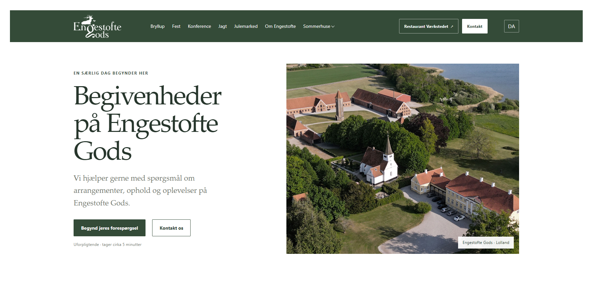
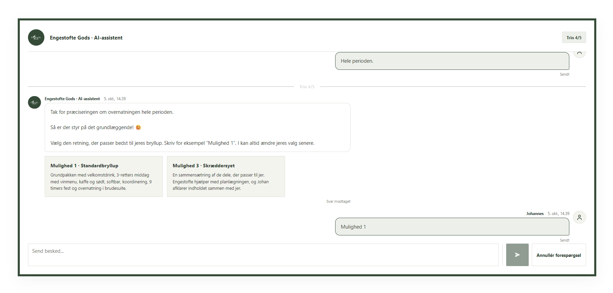
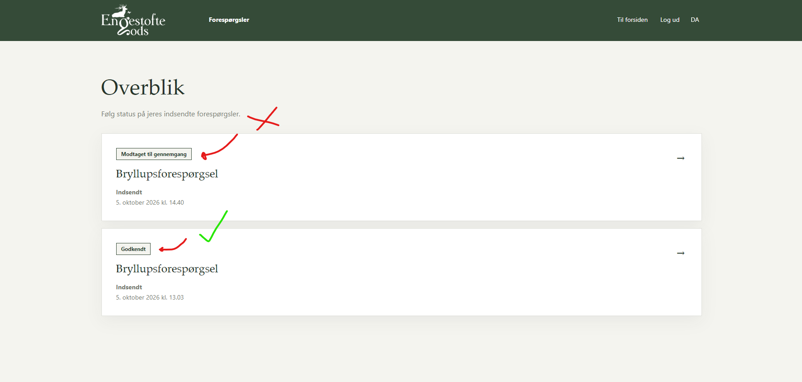
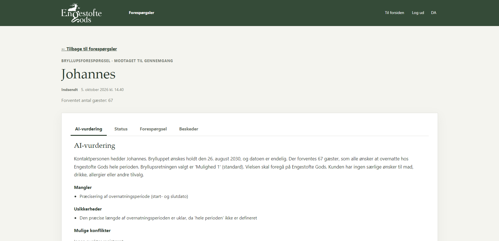
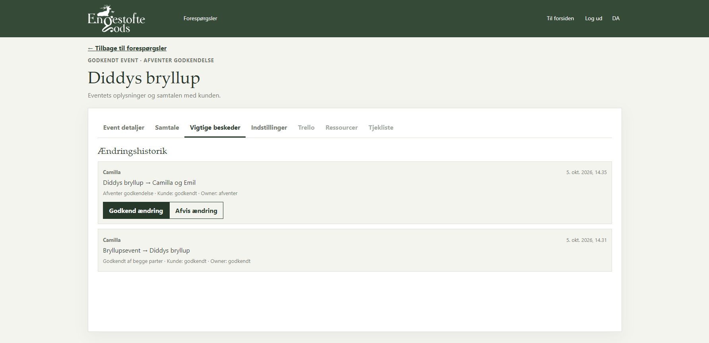

# Engestofte Gods

This project is created for Engestofte Gods for my final AIDA Course project.
During Engestoftes presentation at Lyngby I noted potential cases which later resulted in this product.

The main goal - for which I have set myself - is to give Johan more freetime and allow real customer requests without Johan having to read 1000 mails daily and answer 500 phone calls.

The AI flow and knowledge provided by both Johan and myself results in clear professional, yet personal feedback that handles basic responses and provides a request to Johan or any other Owner role to answer in the events dashboard provided by me aswell.

This results in a place where Souce of Truth lives provided by the Customer and by Johan. If something gets updated - both Engestofte and the Customer get the same updates. Meaning there are no hidden things or things that could have been forgotten as everything is approved by both parties.

---

## Visual Presentation

Visual showcase of the UI elements regarding my solution for Engestofte Gods.

Contact Page to handle customer requests without having to spam call Johan with messages that can be handled prior resulting in free time to focus on actual custom requests.

AI Customer interaction feed with knowledge provided and limitations + personalized yet professional feedback and results.

Pre-approval steps. Seperate dashboard. Once it has been accepted by an owner - it'll spawn an event. Untill then it awaits approval.

Event changes approval system including role based navbar to allow Johan to implement Source of Truth with Trello along with resource tracking.

---

## MVP overview

- Contact Page
- Smiley Rapport button to comply with the fine they almost got in 2025 regarding a missing link on their website
- Personalized images as people paying 100.000kr for a wedding wants to know what the people they book with look like.
- Professional theme 1:1 of their original but where the issues have been fixed.
- Language options moved from flags to letters as per request by Lisa. (Can be triggered by Cloudflare later using IP).
- AI-Flow to handle customer requests to let Johan get more time to focus on actual customers.
- Dashboard for the customer and johan to interact with. This is where they confirm, deny, approve and pay for the wedding itself.
- Source of Truth instead of a Trello board. This solution provides 1 shared Source of Truth for both the customer and the owner. Nothing can be forgotten as it's right there. Entered and approved by both parties. Can later be integrated using Trello API for automatic Trello updates.
- Staff can use the portal aswell to check for duvets, rooms, allergies, food and other misc things needed to finish the wedding. A planning tool could be implemented later on if Johan wants to proceed with the solution.

---

## Links & Deployment

Website: N/A\
Backend: N/A\
Tickets tracking: N/A\
Demo video: N/A

---

## Terms of Use

This program has been created as a School Project for Engestofte Gods (Real Customer). Please do not use, share og exploit any parts of the solution.

Sharing Photos, text, knowledge cards or other features containing Engestofte Gods **is not permitted**.

---

## Technology

- Backend: Java 17, Maven, Javalin, Jackson, Hibernate/JPA and PostgreSQL
- Frontend: React, Vite and React Router
- AI: a document-grounded solution with OpenAI as a possible provider

---

## Documentation

- [Project documentation index](docs/README.md)
- [Current project description and MVP](docs/projekt/02-projekt.md)
- [Domain glossary](CONTEXT.md)
- [System diagram](docs/diagrammer/systemskitse.md)
- [Architecture and file conventions](docs/standards/architecture-and-file-conventions.md)
- [Expected system model](docs/forventet/)
- [RAG material and source documents](RAG/README.md)
- [Contributing guide](CONTRIBUTING.md)

---

    Engestofte Gods — Created by Jonas - 2026

