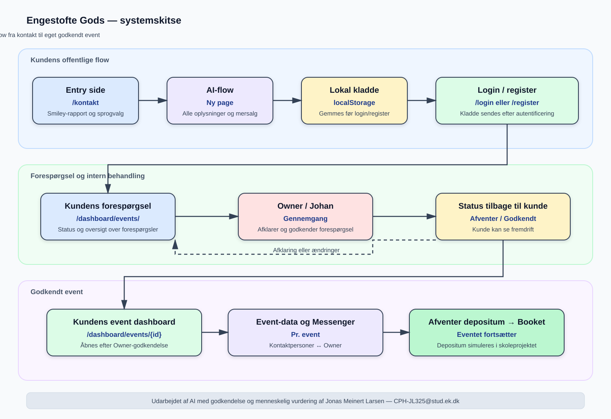

# Systemskitse

Denne systemskitse viser hovedflowet i Engestofte Gods-applikationen på et overordnet niveau. Den beskriver, hvordan en potentiel kunde starter på `engestofte-gods.dk/kontakt`, går videre til AI-flowet og efter login/register kan se forespørgslens status under `/dashboard/events/`. Når Owner/Johan godkender forespørgslen, åbnes kundens konkrete event under `/dashboard/events/{id}`.

## Visuelt diagram



SVG-filen kan åbnes direkte eller indsættes i en rapport. Mermaid-versionen nedenfor fungerer som redigerbar diagramkilde i værktøjer, der understøtter Mermaid.

```mermaid
flowchart TD
    A[engestofte-gods.dk/kontakt<br/>Smiley-rapport og sprogvalg]
    B[AI-flow - ny page<br/>Alle oplysninger og mersalg]
    C[localStorage<br/>Lokal kladde]
    D[Login / register]
    E[/dashboard/events/<br/>Status på forespørgsel]
    F[(Backend og database)]
    G[Owner / Johan<br/>Gennemgår og godkender]
    H{Godkendt?}
    I[/dashboard/events/{id}<br/>Kundens eget event]
    J[Event-data og Messenger<br/>Kontaktpersoner ↔ Owner]
    K[Afventer depositum → Booket]
    L[Staff read-only adgang]

    A --> B
    B --> C
    C --> D
    D --> E
    E --> F
    F --> G
    G --> H
    H -- Nej, afklaring --> E
    H -- Ja --> I
    I --> J
    J --> K
    F -.-> L
```

## Hovedkomponenter

| Komponent | Ansvar |
|---|---|
| `/kontakt` | Entry side med Engestofte Gods, smiley-rapport, sprogvalg og knap til AI-flowet. |
| AI-flow | En ny page, hvor al forespørgselsfunktionalitet foregår: grundoplysninger, opfølgende spørgsmål og ikke-bindende mersalgsforslag. |
| `localStorage` | Gemmer kundens kladde lokalt, indtil kunden opretter bruger eller logger ind. |
| Login/register | Sender kunden videre efter autentificering og afleverer den lokale kladde til backend. |
| `/dashboard/events/` | Viser kundens forespørgsler og status, mens de afventer Owner/Johans gennemgang. |
| Backend og database | Gemmer bruger, forespørgsel, eventdata, beskeder, godkendelser og status efter login. |
| Owner-flow | Giver Owner mulighed for at gennemgå forespørgslen, afklare oplysninger og sende beskeder. |
| `/dashboard/events/{id}` | Kundens konkrete event-platform, som åbnes efter Owner/Johans godkendelse. |
| Event-platform | Viser godkendte eventdata og eventets Messenger mellem kontaktpersoner og Owner. |
| Staff-adgang | Giver read-only adgang til relevante event- og køkkenoplysninger uden Messenger og direkte persondata. |

## Centrale statusovergange

```text
Kladde
  → Indsendt
  → Under gennemgang
  → Afventer kunde
  → Godkendt / Event-platform åben
  → Afventer godkendelse
  → Afventer depositum
  → Booket
```

Hvis den primære kontaktperson aktivt forlader eventet gennem den særlige bekræftelsesproces, bliver status `Annulleret af kunde`. Et annulleret event kan ikke genåbnes; kunden skal oprette en ny forespørgsel.

## Bemærkning

Diagrammet er en systemskitse og ikke en endelig teknisk arkitektur. Den viser brugerroller, hovedflow og systemets vigtigste overgange, men beskriver ikke alle klasser, API-endpoints eller databasedetaljer.

## Udarbejdelse og godkendelse

Skitsen er udarbejdet af AI med godkendelse og menneskelig vurdering af Jonas Meinert Larsen — `CPH-JL325@stud.ek.dk`.
