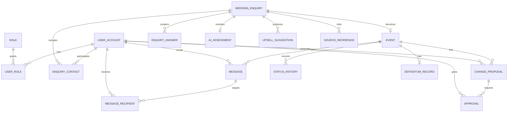

# Forventede PostgreSQL-relationer

**Status:** Foreløbigt MVP-design

Engestofte Gods bruger PostgreSQL som forventet database. Diagrammet viser den forventede relationelle struktur, men konkrete kolonnenavne, ID-type, constraints og migrationsrækkefølge skal fastlægges i de relevante implementation tickets.

## Relationer

## Relation rules

### Identity

- One `UserAccount` can have one or more roles only if the MVP permission model requires it.
- `Role` should be represented as a controlled value or entity, not free text from the client.
- Passwords are stored as hashes, never plaintext.

### Forespørgsel

- A `WeddingEnquiry` belongs to a primary contact relationship and may have additional contact persons.
- A request can exist before an `Event` is approved.
- A request can become one concrete `Event` in the MVP.
- `EnquiryAnswer` preserves structured values and must support conflicts without silently overwriting the original answer.
- The localStorage draft is not in PostgreSQL until authentication and submission succeed.

### Event og kommunikation

- An `Event` belongs to one approved enquiry.
- `Message` always belongs to one event; there is no global customer Messenger.
- `MessageRecipient` stores read state separately per recipient.
- A seven-day `Vigtig besked` can be calculated from message creation time and `MessageRecipient.readAt`.
- Staff access is enforced before data is returned, not only in the frontend.

### Ændringer og approvals

- A `ChangeProposal` records one concrete field change with old value, new value, proposer and status.
- `Approval` records customer and Owner decisions separately.
- A rejected proposal preserves the previously approved value and its explanation.
- The event is not final for booking while required approvals are unresolved.

### Booking

- `DepositumRecord` is a simulation in the school project.
- `BOOKED` requires both-party approval and simulated depositum payment.
- A customer cancellation after paid depositum does not create a refund record in the prototype.
- `CANCELLED_BY_CUSTOMER` is terminal for the event; reopening requires a new enquiry.

## PostgreSQL design expectations

- Use foreign keys for all ownership and relationship boundaries.
- Add unique constraints where the domain requires uniqueness, such as one primary contact per enquiry or one active depositum record per event.
- Add indexes for request status, event ownership, message event/recipient and unread-message lookup.
- Store timestamps with timezone-aware semantics.
- Use explicit enums or controlled values for roles and statuses.
- Do not expose database entities directly through Jackson responses.
- Keep migrations and schema changes within their own explicitly approved ticket.

## Open database decisions

The following choices remain open and must be resolved before the first persistent domain is implemented:

1. UUID or integer IDs.
2. JSONB answers or normalized `EnquiryAnswer` rows.
3. Exact migration tool and naming convention.
4. Whether `UserRole` is needed for multiple roles per account.
5. Retention and deletion behavior for cancelled requests and messages.
6. Whether AI source references are stored locally or only returned by the AI provider.
